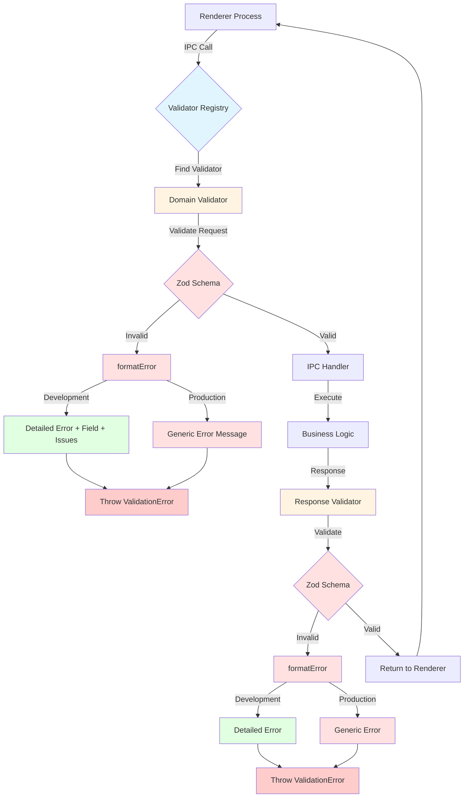

# IPC Validation System Guide

## Architecture Overview

The IPC (Inter-Process Communication) Validation System is a comprehensive security and validation layer that protects the Electron application's main process from invalid or malicious data sent from the renderer process.

### Validation Flow Diagram



### System Components

1. **Validator Registry** (`src/main/ipc/validators/registry.ts`)
   - Central registry of all IPC validators
   - Provides `validateIpcCall()` function for handler usage
   - Handles environment mode detection (development vs production)

2. **Domain Validators**
   - `onboarding.ts`: Validators for onboarding channels
   - `settings.ts`: Validators for settings channels
   - More to be added for other domains

3. **Common Utilities** (`src/main/ipc/validators/common.ts`)
   - `formatError()`: Formats Zod errors based on environment
   - Strict vs non-strict schema handling
   - Environment-based error message behavior

4. **IPC Handler Integration**
   - Validators are called at the start of each IPC handler
   - Invalid requests throw `ValidationError` before business logic
   - Responses are validated before returning to renderer

### Error Message Behavior

The validation system provides different error messages based on the environment:

#### Development Mode (`process.env.NODE_ENV === 'development'`)
```json
{
  "success": false,
  "error": "Validation failed",
  "field": "data.step",
  "issues": [
    {
      "code": "too_small",
      "message": "Number must be greater than or equal to 1",
      "path": ["data", "step"]
    }
  ]
}
```

#### Production Mode (`process.env.NODE_ENV === 'production'`)
```json
{
  "success": false,
  "error": "Invalid request data"
}
```

**Rationale:** Production mode hides internal validation details to prevent information leakage, while development mode provides detailed feedback for debugging.

## Step-by-Step Guide: Adding New Validators

### Step 1: Define Zod Schemas

Create or update a domain validator file in `src/main/ipc/validators/`:

```typescript
// src/main/ipc/validators/mydomain.ts
import { z } from 'zod';

// Request schema - ALWAYS strict to reject extra fields
export const MyActionRequestSchema = z.object({
  // Define your fields here
  itemId: z.string().uuid('Invalid item ID format'),
  quantity: z.number().int('Must be an integer').min(1, 'Must be at least 1'),
  // ... more fields
}).strict(); // IMPORTANT: Rejects unknown fields

// Response schema - NOT strict to allow handlers to add data
export const MyActionResponseSchema = z.object({
  success: z.boolean(),
  data: z.object({
    id: z.string(),
    // ... response fields
  }).optional(),
  error: z.string().optional(),
});
```

### Step 2: Register Validators

Add your schemas to the validator registry:

```typescript
// src/main/ipc/validators/registry.ts
import { MyActionRequestSchema, MyActionResponseSchema } from './mydomain';

export const IPC_VALIDATORS: Record<string, IpcValidator> = {
  // ... existing validators

  'mydomain:my-action': {
    requestSchema: MyActionRequestSchema,
    responseSchema: MyActionResponseSchema,
  },
};
```

### Step 3: Use Validator in Handler

Update your IPC handler to use the validator:

```typescript
// src/main/ipc/handlers/mydomain.handler.ts
import { validateIpcCall } from '../validators/registry';

export async function handleMyAction(event: IpcMainInvokeEvent, requestData: unknown) {
  // Validate request
  const { data } = await validateIpcCall('mydomain:my-action', requestData);

  // Business logic - data is now typed and validated
  const result = await myBusinessLogic(data.itemId, data.quantity);

  // Return result (will be validated against response schema)
  return {
    success: true,
    data: result,
  };
}
```

### Step 4: Write Unit Tests

Create comprehensive tests for your validators:

```typescript
// tests/unit/main/ipc/validators/mydomain.test.ts
import { describe, it, expect } from 'vitest';
import { MyActionRequestSchema, MyActionResponseSchema } from '@/main/ipc/validators/mydomain';

describe('MyDomain Validators', () => {
  describe('MyActionRequestSchema', () => {
    it('should accept valid request', () => {
      const validRequest = {
        itemId: '123e4567-e89b-12d3-a456-426614174000',
        quantity: 5,
      };
      const result = MyActionRequestSchema.safeParse(validRequest);
      expect(result.success).toBe(true);
    });

    it('should reject invalid UUID', () => {
      const invalidRequest = {
        itemId: 'not-a-uuid',
        quantity: 5,
      };
      const result = MyActionRequestSchema.safeParse(invalidRequest);
      expect(result.success).toBe(false);
      if (!result.success) {
        expect(result.error.issues[0].message).toContain('Invalid item ID format');
      }
    });

    it('should reject quantity less than 1', () => {
      const invalidRequest = {
        itemId: '123e4567-e89b-12d3-a456-426614174000',
        quantity: 0,
      };
      const result = MyActionRequestSchema.safeParse(invalidRequest);
      expect(result.success).toBe(false);
    });

    it('should reject extra fields (strict mode)', () => {
      const requestWithExtra = {
        itemId: '123e4567-e89b-12d3-a456-426614174000',
        quantity: 5,
        maliciousField: 'should be rejected',
      };
      const result = MyActionRequestSchema.safeParse(requestWithExtra);
      expect(result.success).toBe(false);
    });
  });

  describe('MyActionResponseSchema', () => {
    it('should accept successful response', () => {
      const validResponse = {
        success: true,
        data: { id: 'item-123' },
      };
      const result = MyActionResponseSchema.safeParse(validResponse);
      expect(result.success).toBe(true);
    });

    it('should accept failed response with error', () => {
      const failedResponse = {
        success: false,
        error: 'Item not found',
      };
      const result = MyActionResponseSchema.safeParse(failedResponse);
      expect(result.success).toBe(true);
    });

    it('should accept extra fields (non-strict)', () => {
      const responseWithExtra = {
        success: true,
        data: { id: 'item-123' },
        extraField: 'allowed in responses',
      };
      const result = MyActionResponseSchema.safeParse(responseWithExtra);
      expect(result.success).toBe(true);
    });
  });
});
```

### Step 5: Write Integration Tests

Add integration tests to verify end-to-end validation:

```typescript
// tests/integration/ipc/validation.test.ts
describe('IPC Validation Integration', () => {
  describe('Request Validation - MyDomain Channel', () => {
    it('should validate mydomain:my-action channel', async () => {
      const validRequest = {
        itemId: '123e4567-e89b-12d3-a456-426614174000',
        quantity: 5,
      };

      // Should not throw
      const { data } = await validateIpcCall('mydomain:my-action', validRequest);
      expect(data).toEqual(validRequest);
    });

    it('should reject invalid request data', async () => {
      const invalidRequest = {
        itemId: 'invalid-uuid',
        quantity: 5,
      };

      await expect(
        validateIpcCall('mydomain:my-action', invalidRequest)
      ).rejects.toThrow(ValidationError);
    });
  });
});
```

### Step 6: Run Tests

```bash
# Run unit tests for your validator
pnpm test tests/unit/main/ipc/validators/mydomain.test.ts

# Run integration tests
pnpm test tests/integration/ipc/validation.test.ts

# Run all IPC validation tests
pnpm test tests/unit/main/ipc/validators/
pnpm test tests/integration/ipc/validation.test.ts
pnpm test tests/security/ipc-validation.test.ts
```

### Step 7: Verify Coverage

```bash
# Generate coverage report
pnpm test:coverage

# Check that your validator files have:
# - ≥80% line coverage
# - ≥70% branch coverage
```

## Testing Strategy

### Unit Tests

Unit tests focus on individual validator schemas:

1. **Happy Path**: Test that valid data passes validation
2. **Field Validation**: Test each field's validation rules (min, max, format, etc.)
3. **Boundary Values**: Test edge cases (empty strings, 0, max values)
4. **Strict Mode**: Verify that extra fields are rejected in request schemas
5. **Non-Strict Mode**: Verify that extra fields are allowed in response schemas
6. **Error Messages**: Verify that custom error messages are used

### Integration Tests

Integration tests verify the complete validation flow:

1. **Registry Lookup**: Verify validators are found by channel name
2. **Environment Mode**: Test both development and production error formats
3. **Error Structure**: Verify error objects have the correct structure
4. **Field Paths**: Verify that field paths are included in development errors
5. **Zod Issues**: Verify that all Zod issues are captured
6. **All Channels**: Test every registered IPC channel

### Security Tests

Security tests focus on preventing malicious inputs:

1. **Prototype Pollution**: Reject `__proto__`, `constructor`, `prototype` injections
2. **SQL Injection**: Validate string fields that could contain SQL
3. **Type Confusion**: Reject type coercion attacks (e.g., strings for numbers)
4. **DoS Prevention**: Reject extremely long strings or deeply nested objects
5. **Sensitive Data Protection**: Ensure API keys aren't leaked in error messages
6. **Input Sanitization**: Verify dangerous patterns are rejected

## Best Practices

### 1. Always Use Strict Mode for Request Schemas

```typescript
// ✅ GOOD - Rejects unknown fields
export const RequestSchema = z.object({
  field: z.string(),
}).strict();

// ❌ BAD - Accepts unknown fields (security risk)
export const RequestSchema = z.object({
  field: z.string(),
});
```

### 2. Never Use Strict Mode for Response Schemas

```typescript
// ✅ GOOD - Allows handlers to add data
export const ResponseSchema = z.object({
  success: z.boolean(),
});

// ❌ BAD - Prevents handlers from adding useful data
export const ResponseSchema = z.object({
  success: z.boolean(),
}).strict();
```

### 3. Use Custom Error Messages

```typescript
// ✅ GOOD - Clear, actionable error
export const Schema = z.object({
  email: z.string().email('Invalid email format'),
});

// ❌ BAD - Generic Zod error
export const Schema = z.object({
  email: z.string().email(),
});
```

### 4. Validate Nested Objects

```typescript
// ✅ GOOD - Validates nested structure
export const Schema = z.object({
  user: z.object({
    name: z.string().min(1),
    email: z.string().email(),
  }),
});

// ❌ BAD - Doesn't validate nested fields
export const Schema = z.object({
  user: z.any(),
});
```

### 5. Use UUID Validation for IDs

```typescript
// ✅ GOOD - Proper UUID validation
export const Schema = z.object({
  itemId: z.string().uuid('Invalid item ID'),
});

// ❌ BAD - Weak validation
export const Schema = z.object({
  itemId: z.string(),
});
```

### 6. Validate Arrays

```typescript
// ✅ GOOD - Validates array contents
export const Schema = z.object({
  tags: z.array(z.string().min(1)).min(1).max(10),
});

// ❌ BAD - Doesn't validate array contents
export const Schema = z.object({
  tags: z.array(z.any()),
});
```

## Error Handling

### ValidationError Class

The system uses a custom `ValidationError` class that extends `Error`:

```typescript
export class ValidationError extends Error {
  constructor(
    message: string,
    public readonly field?: string,
    public readonly issues?: ZodIssue[]
  ) {
    super(message);
    this.name = 'ValidationError';
  }
}
```

### Throwing Validation Errors

Handlers should let `validateIpcCall()` throw validation errors:

```typescript
// ✅ GOOD - Let validator throw
export async function handleMyAction(event: IpcMainInvokeEvent, requestData: unknown) {
  const { data } = await validateIpcCall('mydomain:my-action', requestData);
  // Business logic
}

// ❌ BAD - Catching and hiding validation errors
export async function handleMyAction(event: IpcMainInvokeEvent, requestData: unknown) {
  try {
    const { data } = await validateIpcCall('mydomain:my-action', requestData);
  } catch (error) {
    // Don't hide validation errors!
    return { success: false };
  }
}
```

### Renderer-Side Error Handling

The renderer process should check for validation errors:

```typescript
// In renderer process
try {
  const result = await ipcRenderer.invoke('mydomain:my-action', requestData);
  if (!result.success) {
    // Handle business logic error
  }
} catch (error) {
  if (error instanceof ValidationError) {
    // Handle validation error
    console.error('Validation failed:', error.field, error.issues);
  } else {
    // Handle other errors
  }
}
```

## Coverage Requirements

Per the project constitution, the IPC validation system must maintain:

- **Line Coverage**: ≥80%
- **Branch Coverage**: ≥70%
- **Security-Critical Modules**: 100% branch coverage

Security-critical modules include:
- Validator registry
- Error formatting logic
- Any validation-related security checks

## Troubleshooting

### Validator Not Found

**Error**: `No validator found for channel: mydomain:my-action`

**Solution**: Ensure your validator is registered in `IPC_VALIDATORS` in `registry.ts`.

### Strict Mode Rejection

**Error**: `Unknown key: "extraField"`

**Solution**: Remove extra fields from request or add them to the schema.

### UUID Validation Failed

**Error**: `Invalid UUID`

**Solution**: Ensure UUIDs are in format `xxxxxxxx-xxxx-4xxx-yxxx-xxxxxxxxxxxx`.

### Type Confusion

**Error**: `Expected number, received string`

**Solution**: Ensure type consistency between renderer and main process.

## Additional Resources

- [Zod Documentation](https://zod.dev/)
- [Electron IPC Best Practices](https://www.electronjs.org/docs/latest/tutorial/security#17-validate-the-sender-of-all-ipc-messages)
- [Project Constitution](../constitution.md) - Security requirements
- [Implementation Plan](../tasks/002-user-interaction-system/implementation-plan.md) - T014 details

---

**Last Updated**: 2026-03-07
**Maintained By**: Development Team
