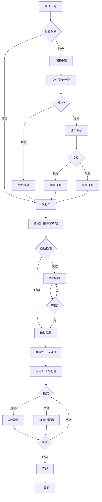
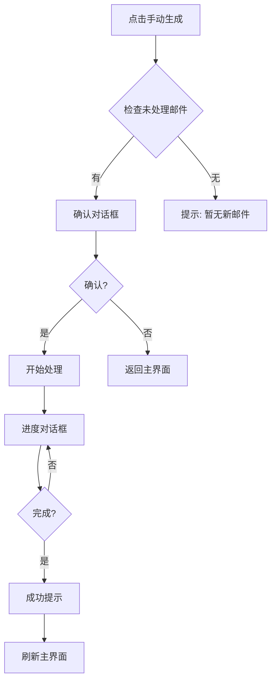
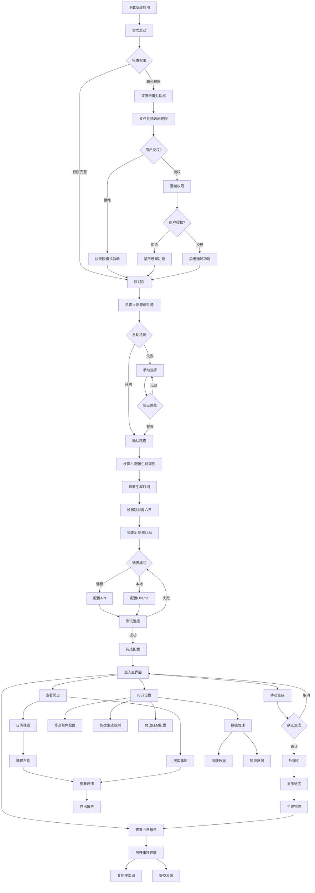
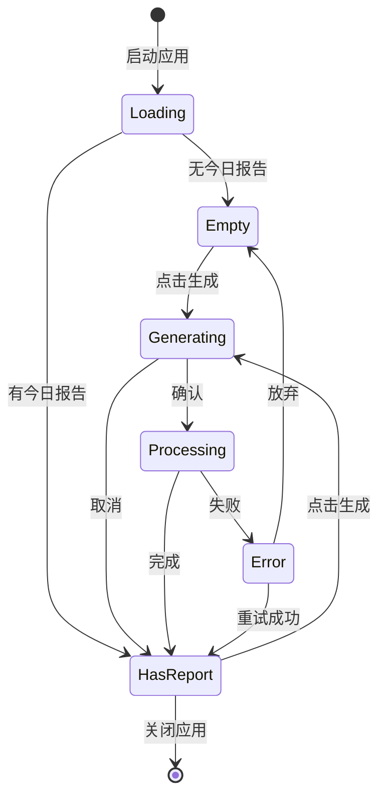

# mailCopilot 用户交互设计文档

**版本**: v1.10 | **日期**: 2026年2月28日 | **状态**: 实施中

## 一、文档概述

### 1.1 设计目标与原则

- **隐私优先**: 所有敏感操作明确提示
- **透明可控**: 用户清楚了解系统状态
- **容错友好**: 错误可恢复,操作可撤销
- **渐进式引导**: 首次使用有引导,高级功能不干扰

### 1.2 已知限制

| 限制项 | 当前版本 | 计划版本 |
|--------|---------|---------|
| 多邮件客户端 | ❌ 单个 | V2.2 |
| 多账号 | ❌ 默认账号 | V2.2 |
| 邮件写入/发送 | ❌ 仅读取 | 待评估 |
| 实时同步 | ❌ 手动/定时 | V2.3 |

---

## 二、用户角色与场景

**目标用户**: 需要处理大量邮件的知识工作者
**使用场景**: 每日邮件整理、任务提取、历史回顾
**技术水平**: 基础计算机操作能力

---

## 三、完整用户流程设计

### 3.1 首次启动配置流程

#### 3.1.1 流程图



#### 3.1.2 界线框图

**步骤1: 邮件客户端配置**

```
+-----------------------------------------------------+
|  mailCopilot 初始配置 (1/3)                         |
+-----------------------------------------------------+
|  [邮件图标] 选择您的邮件客户端                        |
|  +---------------------------------------------+     |
|  | o Thunderbird | o Outlook | o Apple Mail    |     |
|  +---------------------------------------------+     |
|  [自动检测中...]                                      |
|  [OK] 检测到: C:\Users\xxx\...\Thunderbird           |
|  [ 修改路径 ]                                         |
|                            [ 上一步 ]  [ 下一步 > ]   |
+-----------------------------------------------------+
```

**步骤2: 生成规则配置**

```
+-----------------------------------------------------+
|  mailCopilot 初始配置 (2/3)                         |
+-----------------------------------------------------+
|  [时钟图标] 配置每日报告生成规则                      |
|  每日生成时间: [18] : [00]                           |
|  [x] 跳过周六日                                       |
|  [i] 周六日判定基于本地系统时间                       |
|                            [ < 上一步 ]  [ 下一步 > ] |
+-----------------------------------------------------+
```

**步骤3: LLM配置**

```
+-----------------------------------------------------+
|  mailCopilot 初始配置 (3/3)                         |
+-----------------------------------------------------+
|  [AI图标] 选择AI处理模式                             |
|  +---------------------------------------------+     |
|  | * 远程模式 (推荐)  | o 本地模式               |     |
|  +---------------------------------------------+     |
|  API地址: [https://api.openai.com/v1________]      |
|  API密钥: [sk-****************************___]      |
|  [ 测试连接 ]  状态: [OK] 连接成功 (234ms)          |
|                            [ < 上一步 ]  [ 完成 OK ]  |
+-----------------------------------------------------+
```

#### 3.1.3 交互规范

| 元素 | 行为 | 反馈 |
|------|------|------|
| 邮件客户端选择 | 点击切换 | 选中项高亮,触发自动检测 |
| 时间选择 | 滚动/输入 | 实时验证(0-23, 0-59) |
| 跳过周六日 | 点击切换 | 复选框状态切换 |
| 测试连接 | 点击触发 | 按钮禁用,显示加载动画 |
| 下一步 | 验证完成 | 未完成时禁用 |

---

### 3.2 主界面设计

#### 3.2.0 事项分类标准

| 事项类型 | 判断依据 | 数据源 |
|---------|---------|--------|
| **已完成** | LLM识别已完成动作 | LLM语义 |
| **待办** | LLM识别未完成 + 规则库 | LLM + 规则 |
| **需复核** | 置信度 <0.6 | LLM置信度 |

**分类优先级**: 邮件 → LLM分析 → 置信度<0.6? → 需复核 / 判断完成状态

**V1说明**: 规则库为内置默认值,V2开放用户配置

#### 3.2.1 整体布局

```
+----------+------------------------------------------------------+
|          |  [日历] 今日报告 (2026-02-11)        [ 手动生成 ]     |
| [首页]   |  +--------------------------------------------------+ |
| [历史]   |  | ✨ 今日摘要                                        | |
| [设置]   |  | 今天共处理 23 封邮件，其中 3 件需要你重点关注。   | |
|          |  +--------------------------------------------------+ |
|          |  | [OK] 准确: 8条 | [!] 需复核: 2条                | |
|          |  +--------------------------------------------------+ |
|          |  ## 已完成事项 (5) / ## 待办事项 (3)                 |
|          |  +--------------------------------------------------+ |
|          |  | [v] 完成Q3预算审批 [▼]               准确        | |
|          |  |   来源: 王总监 | 2026-02-11 09:15 | Q3预算     | |
|          |  |   [复制搜索词]                   [OK] [X]       | |
|          |  +--------------------------------------------------+ |
+----------+------------------------------------------------------+
```

**今日摘要区块**: 使用模板生成(无需LLM),格式为"今天共处理 {邮件总数} 封邮件,其中 {需复核数} 件需要你重点关注。"

#### 3.2.2 事项卡片详细设计

**置信度语言标签体系**

| 置信度 | 默认模式 | AI解释模式 | 图标 | 卡片样式 |
|--------|---------|-----------|------|----------|
| ≥0.8 | 准确 | 高置信度 (0.85) | [v] | 白色背景 |
| 0.6-0.79 | 需复核 | 中置信度 (0.65) | [!] | 左侧蓝边条 |
| <0.6 | 需复核 | 低置信度 (0.45) | [!!] | 浅黄背景 #FFFBE6 |

**设计要点**:
- 默认模式: 仅显示"准确"或"需复核"
- AI解释模式: 显示具体置信度数值和分类(设置页面开关)
- "复制搜索词"为唯一邮件溯源操作
- 操作按钮: 复制搜索词、反馈按钮(OK/X)
- [▼] 图标用于展开/折叠详情

**折叠态示例(默认模式)**

```
高置信度:
+----------------------------------------------------+
| [v] 完成Q3预算审批 [▼]                  准确      |
|   来源: 王总监 | 2026-02-11 09:15 | Q3预算          |
|   [复制搜索词]                   [OK] [X]           |
+----------------------------------------------------+

低置信度:
+----------------------------------------------------+
| [!!] 参加团队建设活动 [▼]              需复核      |
|   来源: 行政部 | 2026-02-11 16:00 | 活动            |
|   [!] 建议查看原始邮件核对                           |
|   [复制搜索词]                   [OK] [X]           |
+----------------------------------------------------+
```

#### 3.2.3 事项详情展开

**默认模式 - 详情展开**

```
+----------------------------------------------------+
| [v] 完成Q3预算审批 [▲]                  准确      |
|   来源: 王总监 | 2026-02-11 09:15 | Q3预算          |
|   [复制搜索词] [收起详情]                            |
|                   [OK] [X]                           |
|   ------------------------------------------------  |
|   [笔记] 提取依据:                                   |
|   "请在本周五前完成Q3预算的最终审批,并回复确认"      |
|   [邮件] 邮件信息:                                   |
|   - 发件人: 王总监 <wang@company.com>                |
|   - 时间: 2026-02-11 09:15:32                       |
|   - 主题: [财务]Q3预算终版 - 请审批                  |
|   - 搜索词: from:wang@company.com Q3预算 审批        |
+----------------------------------------------------+
```

**AI解释模式**: 增加"置信度分析"模块(置信度分数、分类、判断依据)和完整邮件元数据(Message-ID、文件路径)

#### 3.2.4 事项行内编辑(已移至P1)

**可编辑字段**

| 字段 | 编辑方式 | 验证规则 |
|------|---------|---------|
| 任务标题 | 文本输入框 | 非空,最长200字符 |
| 截止日期 | 日期选择器 | 有效日期格式 |
| 任务描述 | 多行文本框 | 最长500字符 |
| 优先级 | 下拉选择 | 高/中/低 |

**编辑交互**: 双击字段 → 停止输入或失焦1秒 → 自动验证 → 自动保存 → 显示"(已保存)"提示

**视觉反馈**:
- 编辑态: 淡蓝色背景 `#EFF6FF`,智捷蓝边框 `#4F46E5`
- 已修改: 右上角小圆点提示
- 保存成功: 绿色对勾动画
- 保存失败: 抖动+红色错误提示

---

### 3.3 手动生成日报流程

#### 3.3.1 流程图



#### 3.3.2 界线框图

**确认对话框**

```
+-----------------------------------------+
|  生成今日报告                           |
+-----------------------------------------+
|  检测到 23 封未处理邮件                  |
|  是否立即开始生成?                       |
|              [ 取消 ]  [ 开始生成 ]      |
+-----------------------------------------+
```

**处理进度对话框**

```
+-----------------------------------------+
|  正在生成报告...                         |
+-----------------------------------------+
|  [============-------]  52%              |
|  已处理: 12 / 23 封邮件                  |
|  当前: 解析邮件 "Re: 项目进度更新"       |
|                          [ 取消 ]         |
+-----------------------------------------+
```

**完成提示**

```
+-----------------------------------------+
|  [OK] 报告生成完成                       |
+-----------------------------------------+
|  已处理 23 封邮件                        |
|  提取到 8 个事项:                        |
|    - 已完成: 5 个  - 待办: 3 个          |
|  [!] 其中 2 个事项需要复核               |
|                          [ 查看报告 ]     |
+-----------------------------------------+
```

---

### 3.4 历史查询流程

#### 3.4.1 历史页面布局

```
+----------+------------------------------------------------------+
|          |  [日历] 历史报告                                      |
| [首页]   |  +--------------------------------------------------+ |
| [历史]   |  | [搜索] [________________]  [日历] [日期筛选 v]    | |
| [设置]   |  +--------------------------------------------------+ |
|          |  +----------------------------------------------+     |
|          |  |  2026年2月                   [<] [>]           |     |
|          |  |  日 一 二 三 四 五 六                       |     |
|          |  |  9 10 *11 12 13 14 15                      |     |
|          |  |  * = 有报告(蓝色圆点)                        |     |
|          |  +----------------------------------------------+     |
|          |  ## 最近报告                                          |
|          |  +--------------------------------------------------+ |
|          |  | [日历] 2026-02-11 (今天)                          | |
|          |  |    8个事项 | 1个需复核 | [查看详情] [导出]       | |
|          |  +--------------------------------------------------+ |
+----------+------------------------------------------------------+
```

#### 3.4.2 搜索与筛选

**基础搜索**: 支持事项标题、描述、发件人、主题;输入防抖300ms;显示匹配结果数量

**日期筛选**: 全部/今天/最近7天/最近30天/本月/上月/自定义日期范围

**性能优化**: 结果分页(每页20条);关键词高亮显示

---

### 3.5 反馈流程

#### 3.5.1 反馈按钮交互

| 状态 | 显示 | 行为 |
|------|------|------|
| 默认 | `[OK] [X]` | 等待用户点击 |
| 悬停OK | 高亮 | tooltip "标记准确" |
| 悬停X | 高亮 | tooltip "标记错误" |
| 点击OK | "[OK] 已标记为准确" | 2秒后消失 |
| 点击X | 原因选择对话框 | 见下方 |

**错误原因选择对话框**

```
+-----------------------------------------+
|  标记错误原因                           |
+-----------------------------------------+
|  请选择错误类型:                         |
|  o 内容错误 (事项描述不准确)            |
|  o 优先级错误 (不应该是待办/已完成)     |
|  o 非事项 (这不是一个需要处理的事项)    |
|  o 来源错误 (关联的邮件不正确)          |
|  [i] 您的反馈仅存储在本地设备,不会上传  |
|              [ 取消 ]  [ 提交 ]          |
+-----------------------------------------+
```

**提交后**: Toast提示"[OK] 反馈已记录"(3秒);事项卡片显示[已反馈]标记

#### 3.5.2 批量操作功能(已移至P2)

**⚠️ 说明**: 本功能已移至P2(V1.2优化体验),MVP阶段不包含

批量操作包括: 全部标记准确/已完成、清除已完成、批量删除、批量导出

---

### 3.6 桌面通知系统

#### 3.6.1 通知类型与触发场景

| 通知类型 | 优先级 | 触发场景 | 持续时间 | 可交互 |
|---------|--------|---------|---------|--------|
| 报告生成完成 | 普通 | 定时/手动生成完成 | 5秒 | 是 |
| 系统状态变更 | 低 | 配置更新、权限变更 | 3秒 | 否 |
| 错误警告 | 紧急 | 处理失败、连接异常 | 常驻 | 是 |

#### 3.6.2 通知UI设计

**报告生成完成通知**

```
+---------------------------------------------+
| [mailCopilot] 今日报告已生成              [×] |
+---------------------------------------------+
|  ✓ 成功处理 23 封邮件                         |
|  • 已完成事项: 5 个  • 待办事项: 3 个         |
|  • 需要复核: 2 个                             |
|            [ 查看报告 ]                       |
+---------------------------------------------+
```

**系统错误通知**

```
+---------------------------------------------+
| [mailCopilot] 无法连接到AI服务              [×] |
+---------------------------------------------+
|  [!] 连接失败,已切换到本地模式               |
|  错误: Connection timeout                    |
|                   [ 查看日志 ]               |
+---------------------------------------------+
```

#### 3.6.3 通知行为规范

| 规则项 | 说明 |
|--------|------|
| 防打扰时段 | 22:00 - 08:00 不显示非紧急通知 |
| 聚合规则 | 3分钟内同类通知合并为一条 |
| 频率限制 | 单个事项最多提醒2次 |
| 自动关闭 | 普通通知5秒后自动消失,紧急通知需手动关闭 |

#### 3.6.4 通知权限管理

**设置页面 - 通知配置**

```
+--------------------------------------------------------------+
|  [铃铛] 通知设置                                               |
+--------------------------------------------------------------+
|  桌面通知:                                                    |
|  [ * ] 启用桌面通知  [   ] 仅在重要事项时通知  [   ] 完全禁用   |
|  防打扰时段: [x] 启用防打扰模式 (22:00 - 08:00)                |
|  通知声音: [ * ] 启用提示音  [   ] 静音模式                    |
|  [ 测试通知 ]                                                 |
+--------------------------------------------------------------+
```

---

### 3.7 设置页面

#### 3.7.0 应用更新机制

**更新检查流程**: 启动时自动检查 → 发现新版本 → 显示更新对话框 → 用户选择 → 后台下载 → 提示重启 → 安装更新

**更新重要性判断**

| 版本变化类型 | 示例 | 重要性 | 处理方式 |
|------------|------|--------|---------|
| 主版本号 (Major) | v1.x → v2.0 | 重要 | 立即提示,显示详细说明 |
| 次版本号 (Minor) | v1.2 → v1.3 | 普通功能 | 显示通知,可选"稍后提醒" |
| 修订号 (Patch) | v1.2.0 → v1.2.1 | 小修复 | 后台静默更新,启动时提示 |
| 安全补丁 | v1.2.0-security | 重要安全 | 立即提示,强制建议更新 |

**自动更新策略**

| 场景 | 行为 |
|------|------|
| 启动时检查 | 后台静默检查,发现新版本后显示通知气泡 |
| 定期检查 | 每7天自动检查一次 |
| 重要安全更新 | 立即提示,并提供"一键更新" |
| 普通功能更新 | 显示通知,用户可选"稍后提醒" |

**发现新版本对话框**

```
+-----------------------------------------+
|  [mailCopilot] 发现新版本               |
+-----------------------------------------+
|  当前版本: v1.3.0  |  最新版本: v1.4.0   |
|  [i] 更新内容:                             |
|  • 新增: 事项标签系统  • 优化: 搜索性能    |
|  发布时间: 2026-03-15  |  更新大小: 45.2MB |
|              [ 稍后提醒 ]  [ 立即更新 ]    |
+-----------------------------------------+
```

**下载完成提示**

```
+-----------------------------------------+
|  [OK] 更新已下载完成                     |
+-----------------------------------------+
|  更新包已下载完成,需要重启应用以安装      |
|  • 当前版本: v1.3.0  • 更新版本: v1.4.0   |
|  [!] 重启后应用将关闭并自动安装           |
|              [ 稍后重启 ]  [ 立即重启 ]    |
+-----------------------------------------+
```

**更新设置**

```
+--------------------------------------------------------------+
|  [i] 关于                                                     |
+--------------------------------------------------------------+
|  版本: v1.3.0  |  [ 检查更新 ]                               |
|  自动更新:                                                    |
|  [ * ] 自动检查更新 (推荐)  [   ] 仅手动检查更新               |
|  [ ] 下载重要安全更新无需询问  [ ] 下载功能更新前先提示        |
|  [ 查看更新日志 ]  [ 反馈问题 ]                               |
+--------------------------------------------------------------+
```

#### 3.7.1 设置页面布局

```
+----------+------------------------------------------------------+
|          |  [齿轮] 设置                                          |
| [首页]   |  +--------------------------------------------------+ |
| [历史]   |  | [邮件] 邮件配置                                   | |
| [设置]   |  | 邮件客户端: Thunderbird | [ 修改路径 ]          | |
|          |  +--------------------------------------------------+ |
|          |  +--------------------------------------------------+ |
|          |  | [时钟] 生成规则                                   | |
|          |  | 每日生成时间: [18] : [00] | [x] 跳过周六日       | |
|          |  +--------------------------------------------------+ |
|          |  +--------------------------------------------------+ |
|          |  | [AI] AI模式配置                                   | |
|          |  | 当前模式: * 远程模式  o 本地模式                   | |
|          |  | API地址: https://api.openai.com/v1                | |
|          |  | API密钥: sk-****************************          | |
|          |  | [ 测试连接 ] [OK] 连接正常                        | |
|          |  +--------------------------------------------------+ |
|          |  +--------------------------------------------------+ |
|          |  | [显示] 显示设置                                   | |
|          |  | [ ] AI解释模式 (显示置信度分数和技术细节)         | |
|          |  +--------------------------------------------------+ |
|          |  +--------------------------------------------------+ |
|          |  | [铃铛] 通知设置                                   | |
|          |  | 桌面通知: [*] 启用 | [x] 防打扰模式 (22:00-08:00)| |
|          |  +--------------------------------------------------+ |
|          |  +--------------------------------------------------+ |
|          |  | [数据] 数据管理                                   | |
|          |  | 本地数据: 45.2 MB | 反馈统计: 本月修正5处        | |
|          |  | [ 清理30天前数据 ] | [ 清空所有历史 ]            | |
|          |  | [ 立即销毁所有反馈数据 ]                          | |
|          |  +--------------------------------------------------+ |
|          |  +--------------------------------------------------+ |
|          |  | [i] 关于 | 版本: v1.3.0 | [ 检查更新 ]            | |
|          |  +--------------------------------------------------+ |
+----------+------------------------------------------------------+
```

#### 3.7.2 危险操作确认对话框

**清空所有历史**

```
+-----------------------------------------+
|  [!!] 确认清空所有历史                   |
+-----------------------------------------+
|  此操作将永久删除:                       |
|  - 所有历史日报 (共 45 份)              |
|  - 所有事项记录 (共 523 条)             |
|  - 所有反馈数据                          |
|  [!!] 此操作不可撤销!                    |
|  请输入 "确认删除" 以继续:               |
|  +-------------------------------------+ |
|  |                                     | |
|  +-------------------------------------+ |
|              [ 取消 ]  [ 删除 ]          |
+-----------------------------------------+
```

**立即销毁所有反馈数据**

```
+-----------------------------------------+
|  [!!] 确认销毁反馈数据                   |
+-----------------------------------------+
|  此操作将永久删除所有反馈数据:          |
|  - 准确性标记: 156 条  - 错误反馈: 5 条  |
|  [!!] 删除后无法恢复!                    |
|              [ 取消 ]  [ 确认销毁 ]      |
+-----------------------------------------+
```

---

## 四、组件交互规范

### 4.1 按钮规范

| 按钮类型 | 样式 | 使用场景 | 交互反馈 |
|---------|------|----------|----------|
| 主要按钮 | 蓝色背景,白色文字 | 主要操作 | hover变深,点击涟漪 |
| 次要按钮 | 白色背景,灰色边框 | 次要操作 | hover边框变深 |
| 危险按钮 | 红色背景,白色文字 | 删除、销毁 | hover变深红,需二次确认 |
| 图标按钮 | 透明背景,图标 | 反馈按钮(OK/X) | hover显示tooltip |
| 链接按钮 | 蓝色文字,无边框 | 查看详情、复制 | hover下划线 |

### 4.2 输入框规范

| 输入类型 | 验证规则 | 错误提示 | 成功提示 |
|---------|---------|---------|---------|
| 文件路径 | 路径存在且包含邮件文件 | "未找到邮件文件,请检查路径" | 绿色对勾 |
| API地址 | URL格式,https协议 | "请输入有效的HTTPS地址" | "格式正确" |
| API密钥 | 非空,长度>20 | "密钥不能为空" | 自动隐藏显示 |
| 时间选择 | 0-23小时,0-59分钟 | "请输入有效时间" | 实时更新预览 |

### 4.3 加载状态规范

| 场景 | 加载样式 | 文案 | 可取消 |
|------|---------|------|--------|
| 路径检测 | 小型旋转图标 | "检测中..." | 否 |
| 连接测试 | 按钮内旋转图标 | "测试中..." | 否 |
| 邮件处理 | 进度条+百分比 | "已处理 X/N 封" | 是 |
| 报告生成 | 进度条+当前任务 | "正在解析邮件..." | 是 |
| 数据加载 | 骨架屏 | 无文案 | 否 |

### 4.4 Toast提示规范

| 类型 | 图标 | 颜色 | 持续时间 | 示例 |
|------|------|------|----------|------|
| 成功 | [OK] | 绿色 | 3秒 | "反馈已记录" |
| 错误 | [X] | 红色 | 5秒 | "连接失败,请检查网络" |
| 警告 | [!] | 黄色 | 4秒 | "检测到1个需复核事项" |
| 信息 | [i] | 蓝色 | 3秒 | "配置已保存" |

---

## 五、状态与反馈设计

### 5.1 空状态设计

**首页 - 无今日报告**

```
+----------------------------------------+
|           [邮箱图标]                     |
|      今日暂无报告                        |
|   系统将在每天 18:00 自动生成 /*时间动态读取*/           |
|   或点击下方按钮手动生成                 |
|        [ 立即生成报告 ]                  |
+----------------------------------------+
```

**首页 - 今日无任务**

```
+----------------------------------------+
|           [庆祝图标]                     |
|   太棒了!AI 未发现任何急需处理的        |
|             杂事                        |
|   你可以专注于核心工作了                 |
|   今日份的邮件已全部化解                 |
|      享受你的专注时光吧                  |
+----------------------------------------+
```

**历史页 - 无历史记录**

```
+----------------------------------------+
|           [文件夹图标]                   |
|      暂无历史报告                        |
|   生成第一份报告后将在此显示             |
+----------------------------------------+
```

**搜索 - 无结果**

```
+----------------------------------------+
|           [搜索图标]                     |
|      未找到匹配的事项                    |
|   尝试使用其他关键词搜索                 |
|        [ 清除搜索 ]                      |
+----------------------------------------+
```

### 5.2 错误状态设计

**邮件路径无效**

```
+----------------------------------------+
|  [X] 邮件路径错误                       |
+----------------------------------------+
|  无法在指定路径找到邮件文件:            |
|  C:\Users\xxx\Thunderbird\Profiles      |
|  可能的原因: 路径不存在 / 无权限 / 未安装 |
|  [ 重新选择路径 ]  [ 查看帮助 ]         |
+----------------------------------------+
```

**LLM连接失败**

```
+----------------------------------------+
|  [X] 无法连接到AI服务                   |
+----------------------------------------+
|  错误详情: Connection timeout after 30s  |
|  请检查: 网络连接 / API地址 / API密钥    |
|  [ 重试 ]  [ 修改配置 ]  [ 查看日志 ]   |
+----------------------------------------+
```

**邮件解析失败**

```
+----------------------------------------+
|  [!] 部分邮件解析失败                   |
+----------------------------------------+
|  成功: 20 封  |  失败: 3 封             |
|  失败原因: 格式损坏(2封) / 超过大小限制(1封) |
|  已跳过失败的邮件,继续生成报告          |
|  [ 查看详情 ]  [ 继续 ]                 |
+----------------------------------------+
```

### 5.3 处理中状态

**邮件处理进度 - 详细版**

```
+-----------------------------------------+
|  正在生成报告...                         |
+-----------------------------------------+
|  总体进度: [================]  65%       |
|  当前阶段: 邮件解析 (2/3) [====] 100%    |
|  详细信息:                                |
|  [OK] 邮件读取: 23/23 封                |
|  [..] 邮件解析: 15/23 封                |
|  [--] AI处理: 0/23 封                   |
|  当前处理: "Re: 项目进度更新 - 第三季度"  |
|                          [ 取消 ]         |
+-----------------------------------------+
```

---

## 六、响应式与可访问性

### 6.1 窗口尺寸规范

| 尺寸类型 | 宽度 | 高度 | 说明 |
|---------|------|------|------|
| 最小窗口 | 800px | 600px | 低于此尺寸显示警告 |
| 推荐窗口 | 1200px | 800px | 默认启动尺寸 |
| 最大窗口 | 无限制 | 无限制 | 内容居中,最大宽度1600px |

### 6.2 键盘导航(已移至P2)

**⚠️ 说明**: 本功能已移至P2(V1.2优化体验),MVP阶段仅支持基础Tab键焦点切换和Esc键关闭对话框

| 快捷键 | 功能 | 适用页面 |
|--------|------|----------|
| Tab | 焦点切换 | 全局 |
| Enter | 确认/提交 | 全局 |
| Esc | 取消/关闭对话框 | 全局 |
| Ctrl+G | 手动生成报告 | 首页 |
| Ctrl+H | 跳转历史页 | 全局 |
| Ctrl+, | 打开设置 | 全局 |
| Ctrl+F | 搜索 | 历史页 |

### 6.3 屏幕阅读器支持

| 元素 | ARIA标签 | 说明 |
|------|---------|------|
| 事项卡片 | role="article" | 独立内容块 |
| 反馈按钮 | aria-label="标记准确/错误" | 明确按钮用途 |
| 置信度标识 | aria-label="置信度0.85,高" | 读出具体数值 |
| 进度条 | aria-valuenow, aria-valuemax | 实时更新进度 |
| 加载状态 | aria-live="polite" | 通知状态变化 |

---

## 七、视觉设计指南

### 7.1 色彩系统(深邃专业风)

| 用途 | 颜色名称 | 色值 | 使用场景 | 设计意图 |
|------|---------|------|----------|----------|
| 主色 | 智捷蓝 | `#4F46E5` | 主要按钮、链接、选中状态 | 结合传统邮件蓝色与AI紫色,传达智慧与稳定 |
| 辅助色 | 灵动青 | `#06B6D4` | "AI处理中"状态、"新发现"强调 | 体现轻量与灵动,用于动态反馈 |
| 成功 | 翠绿 | `#10B981` | 准确状态、成功提示 | 清晰表示准确状态 |
| 警告 | 琥珀黄 | `#F59E0B` | 需复核状态(中)、警告提示 | 柔和提醒,不刺眼 |
| 错误 | 珊瑚红 | `#EF4444` | 需复核状态(低)、错误提示 | 明确警示,避免误操作 |
| 背景 | 极简灰 | `#F8FAFC` | 主背景 | 极淡灰蓝色,减少长时间阅读的视觉疲劳 |
| 文字 | 深岩灰 | `#1E293B` | 主要文字 | WCAG标准高可读性 |
| 次要文字 | 中灰 | `#64748B` | 次要文字、元数据 | 保持层次感 |
| 禁用状态 | 浅灰 | `#CBD5E1` | 禁用按钮、占位符 | 清晰表达不可用状态 |
| 卡片背景 | 纯白 | `#FFFFFF` | 卡片、输入框背景 | 与极简灰背景形成对比 |
| 边框 | 淡灰蓝 | `#E2E8F0` | 分割线、边框 | 柔和分隔,不喧宾夺主 |

**色彩对比度验证**(符合WCAG AA标准)
- 深岩灰 on 极简灰: 14.3:1 ✅
- 智捷蓝 on 纯白: 5.1:1 ✅
- 次要文字 on 极简灰: 4.8:1 ✅

**深色模式**: 当前为浅色方案,深色模式计划在P2阶段补充设计

### 7.2 字体规范

| 用途 | 字体 | 大小 | 粗细 | 行高 |
|------|------|------|------|------|
| 页面标题 | Inter | 24px | 600 | 32px |
| 章节标题 | Inter | 18px | 600 | 26px |
| 正文 | Inter | 14px | 400 | 22px |
| 小字 | Inter | 12px | 400 | 20px |
| 按钮文字 | Inter | 14px | 500 | 22px |
| 代码/路径 | Consolas | 13px | 400 | 20px |

### 7.3 间距规范

| 类型 | 尺寸 | 使用场景 |
|------|------|----------|
| 超小 | 4px | 图标与文字间距 |
| 小 | 8px | 按钮内边距、标签间距 |
| 中 | 16px | 卡片内边距、表单项间距 |
| 大 | 24px | 章节间距、卡片外边距 |
| 超大 | 32px | 页面边距 |

### 7.4 圆角与阴影规范

**圆角**

| 元素 | 圆角 |
|------|------|
| 按钮 | 4px |
| 输入框 | 4px |
| 卡片 | 8px |
| 对话框 | 8px |
| 标签 | 12px |

**阴影**

| 层级 | 阴影 | 使用场景 |
|------|------|----------|
| 1级 | 0 2px 8px rgba(0,0,0,0.08) | 卡片 |
| 2级 | 0 4px 16px rgba(0,0,0,0.12) | 悬浮卡片、下拉菜单 |
| 3级 | 0 8px 24px rgba(0,0,0,0.16) | 对话框、模态框 |

---

## 八、动画与过渡

### 8.1 过渡时间

| 类型 | 时长 | 缓动函数 | 使用场景 |
|------|------|----------|----------|
| 快速 | 150ms | ease-out | 按钮hover、焦点切换 |
| 标准 | 300ms | ease-in-out | 展开/折叠、淡入淡出 |
| 慢速 | 500ms | ease-in-out | 页面切换、大型动画 |

### 8.2 动画效果

| 效果 | 描述 | 使用场景 |
|------|------|----------|
| 淡入淡出 | opacity 0到1 | Toast提示、对话框出现 |
| 滑入滑出 | transform translateY | 下拉菜单、抽屉 |
| 展开折叠 | max-height 0到auto | 事项详情展开 |
| 涟漪效果 | 点击位置扩散圆形 | 按钮点击反馈 |
| 骨架屏 | 渐变扫过效果 | 内容加载中 |

---

## 九、错误处理与边界情况

### 9.1 网络异常

| 场景 | 处理方式 | 用户提示 |
|------|---------|---------|
| 初始连接失败 | 显示错误对话框,提供重试 | "无法连接到服务器,请检查网络" |
| 处理中断网 | 暂停处理,显示重连提示 | "网络连接中断,正在重试..." |
| 超时 | 30秒后超时,提示用户 | "请求超时,请稍后重试" |

### 9.2 数据异常

| 场景 | 处理方式 | 用户提示 |
|------|---------|---------|
| 邮件格式损坏 | 跳过该邮件,记录日志 | "跳过1封损坏的邮件" |
| 数据库损坏 | 尝试修复,失败则提示重置 | "数据库异常,建议备份后重置" |
| 配置文件损坏 | 恢复默认配置 | "配置已重置为默认值" |

### 9.3 边界情况

| 场景 | 处理方式 | 用户提示 |
|------|---------|---------|
| 无新邮件 | 禁用生成按钮 | "暂无新邮件" |
| 邮件过多(>1000) | 分批处理,显示总进度 | "检测到1234封邮件,将分批处理" |
| 磁盘空间不足 | 阻止操作,提示清理 | "磁盘空间不足,请清理后重试" |
| 单封邮件过大(>20MB) | 跳过该邮件 | "跳过1封超大邮件(25MB)" |

---

## 十、用户引导与帮助

### 10.1 首次使用引导

**引导气泡(Tooltip Tour)**

步骤1: 指向侧边栏"首页" - "欢迎使用 mailCopilot! 这里是首页,可以查看今日报告" - [下一步]

步骤2: 指向"手动生成"按钮 - "点击这里可以手动生成报告,系统也会在每天18:00自动生成" - [上一步] [下一步]

步骤3: 指向事项卡片的反馈按钮 - "发现错误? 点击X按钮反馈,您的反馈将帮助系统持续优化" - [上一步] [完成]

### 10.2 帮助文档入口

**设置页底部**

```
+----------------------------------------+
| [?] 需要帮助?                          |
| [ 查看使用教程 ]  [ 常见问题 FAQ ]      |
| [ 反馈问题 ]  [ 加入社区 ]              |
+----------------------------------------+
```

### 10.3 上下文帮助

- 所有图标按钮悬停显示功能说明(Tooltip)
- 复杂配置项显示"?"图标,点击显示详细说明
- 错误提示包含"查看帮助"链接,跳转到相关文档

---

## 十一、性能优化

### 11.1 渲染优化

| 优化项 | 实现方式 | 预期效果 |
|--------|---------|---------|
| 虚拟滚动 | 历史列表超过50条时启用 | 流畅滚动大量数据 |
| 懒加载 | 事项详情按需加载 | 减少初始渲染时间 |
| 防抖 | 搜索输入300ms防抖 | 减少不必要的查询 |
| 节流 | 滚动事件100ms节流 | 提升滚动性能 |

### 11.2 数据缓存

| 缓存项 | 策略 | 失效条件 |
|--------|------|---------|
| 今日报告 | 内存缓存 | 手动生成或跨天 |
| 历史列表 | 内存缓存 | 新增报告或删除 |
| 配置信息 | 持久化缓存 | 用户修改 |

---

## 十二、测试用例

### 12.1 首次启动流程测试

| 测试场景 | 操作步骤 | 预期结果 |
|---------|---------|---------|
| 正常配置流程 | 选择Thunderbird → 自动检测成功 → 配置生成时间 → 配置远程LLM → 测试连接成功 → 完成 | 进入主界面,显示空状态 |
| 路径检测失败 | 选择Thunderbird → 自动检测失败 | 显示手动配置入口 |
| LLM连接失败 | 输入错误API地址 → 点击测试连接 | 显示错误提示,允许修改 |
| 中途退出 | 配置到步骤2 → 关闭窗口 → 重新启动 | 从步骤2继续配置 |

### 12.2 日报生成流程测试

| 测试场景 | 操作步骤 | 预期结果 |
|---------|---------|---------|
| 正常生成 | 点击"手动生成" → 确认对话框 → 等待完成 | 显示新报告,事项正确 |
| 无新邮件 | 点击"手动生成" | 按钮禁用,提示无新邮件 |
| 中途取消 | 开始生成 → 点击取消 | 停止处理,返回主界面 |
| 部分失败 | 包含损坏邮件 → 开始生成 | 跳过失败邮件,显示警告 |

### 12.3 反馈流程测试

| 测试场景 | 操作步骤 | 预期结果 |
|---------|---------|---------|
| 标记准确 | 点击OK按钮 | 显示成功提示,按钮变灰 |
| 标记错误 | 点击X按钮 → 选择原因 → 提交 | 显示成功提示,事项标记"已反馈" |
| 取消反馈 | 点击X按钮 → 点击取消 | 关闭对话框,无变化 |

---

## 十三、实施优先级

### 13.1 P0 - 核心流程(MVP)

- [ ] 首次启动配置流程(邮件客户端选择、路径检测、生成规则、LLM配置)
- [ ] 主界面布局与事项展示
  - [ ] 今日摘要区块(模板文案,无需LLM)
  - [ ] 置信度标签(默认模式:准确/需复核)
  - [ ] AI解释模式开关(设置页面)
  - [ ] 事项卡片展示
  - [ ] 事项详情展开(默认模式)
- [ ] 手动生成日报流程(确认、进度、完成)
- [ ] 基础反馈流程(单个事项OK/X按钮、原因选择、Toast提示)
- [ ] 基础搜索功能(事项标题、描述、发件人、主题)
- [ ] 设置页面(邮件配置、生成规则、LLM配置、显示设置、数据管理)
- [ ] 基础色彩系统(深邃专业风:智捷蓝、灵动青、极简灰)

### 13.2 P1 - 重要功能(V1.1)

- [ ] 事项行内编辑(双击编辑字段、实时验证、自动保存)
- [ ] 历史查询与列表视图
- [ ] 桌面通知系统(报告生成完成、重要事项提醒、错误警告)
- [ ] 搜索功能增强(防抖、分页、高亮显示)
- [ ] 事项详情展开(AI解释模式完整版)

### 13.3 P2 - 优化体验(V1.2)

- [ ] 批量操作功能(批量标记、清除已完成、批量导出)
- [ ] 日历视图
- [ ] 键盘导航(快捷键支持)
- [ ] 深色模式
- [ ] 动画与过渡(编辑态动画、保存反馈动画)
- [ ] 首次使用引导(Tooltip Tour)

### 13.4 P3 - 锦上添花(V2.0)

- [ ] 屏幕阅读器支持
- [ ] 导出功能优化
- [ ] 性能监控面板
- [ ] 搜索建议与智能补全

---

## 十四、与PRD/技术文档的映射关系

### 14.1 PRD需求覆盖

| PRD需求ID | 对应UI设计章节 | 实现状态 |
|----------|---------------|---------|
| TRACE-02 | 3.2.2 事项卡片详细设计 | 已设计 |
| TRACE-03 | 3.2.3 事项详情展开 | 已设计 |
| ACC-02 | 3.2.2 置信度标识 | 已设计 |
| ACC-04 | 3.5 反馈流程 | 已设计 |
| REPORT-05 | 3.2.1 主界面顶部摘要 | 已设计 |
| REPORT-06 | 3.5.1 反馈按钮交互 | 已设计 |

### 14.2 技术文档对接

| 技术模块 | UI对应功能 | 数据流向 |
|---------|-----------|---------|
| 配置管理器 | 3.1 首次启动配置 / 3.7 设置页 | UI → IPC → 主进程 |
| LLM适配层 | 3.3 手动生成进度显示 | 主进程 → IPC → UI |
| 历史存储管理器 | 3.4 历史查询 | UI → IPC → SQLite |
| 溯源链接生成器 | 3.2.3 复制搜索词按钮 | 主进程 → IPC → UI |
| 反馈存储 | 3.5 反馈流程 | UI → IPC → SQLite |

---

## 十五、设计决策记录(ADR)

### ADR-001: 为什么不使用深度链接跳转邮件?

**背景**: PRD要求用户能快速定位原始邮件

**决策**: 使用"复制搜索关键词"而非深度链接

**理由**: 不同邮件客户端的URL scheme不统一;部分客户端不支持外部调用;搜索关键词方案通用性更强;技术实现复杂度低

**后果**: 用户需要手动粘贴搜索,增加一步操作

### ADR-002: 为什么首次配置不支持跳过?

**背景**: 用户可能想先体验再配置

**决策**: 强制完成首次配置才能进入主界面

**理由**: 邮件路径是核心功能必需项;LLM配置缺失会导致功能完全不可用;避免用户进入"半配置"状态;引导用户正确理解产品价值

**后果**: 增加首次使用门槛,但保证后续体验流畅

### ADR-003: 为什么反馈按钮放在事项卡片内?

**背景**: 反馈功能需要明显但不干扰

**决策**: 将OK/X按钮放在每个事项卡片右上角

**理由**: 就近原则,用户验证后立即反馈;不占用额外空间;图标简洁,不干扰阅读;符合用户心智模型(类似点赞/点踩)

**后果**: 小屏幕下可能需要调整布局

### ADR-004: 为什么使用ASCII线框图而非图片?

**背景**: 需要快速迭代UI设计

**决策**: 使用ASCII Art绘制线框图

**理由**: 纯文本易于版本控制;修改成本低,迭代快;开发者可直接在文档中查看;不依赖设计工具

**后果**: 视觉表现力有限,后续需补充高保真原型

---

## 十六、常见问题(FAQ)

### Q1: 用户如何知道系统正在自动生成报告?

系统会在设置的生成时间(默认18:00):
1. 显示系统托盘通知: "正在生成今日报告..."
2. 主界面顶部显示进度条(如果应用已打开)
3. 完成后显示通知: "今日报告已生成,发现8个事项"

### Q2: 如果用户在生成过程中关闭应用会怎样?

- 显示确认对话框: "报告生成中,确定要退出吗?"
- 用户确认后,Electron主进程继续在后台完成生成
- 下次启动时显示: "上次生成已完成"

### Q3: 需复核事项的黄色高亮会不会太显眼?

- 使用浅黄色背景(#FFFBE6),不刺眼
- 仅在置信度<0.6时显示(低置信度事项)

### Q4: 历史报告数量很多时如何优化性能?

- 使用虚拟滚动,仅渲染可见区域
- 按月分组折叠显示
- 搜索结果限制显示前100条
- 提供"归档旧报告"功能

### Q5: 如何处理用户误删数据的情况?

- 所有删除操作都需要二次确认
- 删除前显示具体影响范围
- 提供"最近删除"回收站(保留7天)
- 建议用户定期导出备份

---

## 十七、附录

### 附录A: 完整用户流程Mermaid图



### 附录B: 关键页面状态机

**主界面状态机**



### 附录C: 组件库选型对比

| 组件库 | 优点 | 缺点 | 推荐度 |
|--------|------|------|--------|
| shadcn/ui | 可定制性强,无运行时依赖 | 需要手动集成 | 5/5 (已选定) |
| Ant Design | 组件丰富,文档完善 | 体积较大,样式难定制 | 4/5 |
| Material-UI | 设计规范成熟 | 样式与产品风格不符 | 3/5 |
| Chakra UI | 易用性好 | 生态较小 | 3/5 |

**最终选择**: shadcn/ui + Tailwind CSS(已在技术文档中确定)

### 附录D: 可访问性检查清单

- [ ] 所有交互元素可通过键盘访问
- [ ] 焦点顺序符合逻辑
- [ ] 所有图标按钮有aria-label
- [ ] 颜色对比度符合WCAG AA标准
- [ ] 表单错误提示与输入框关联
- [ ] 动态内容变化有aria-live通知
- [ ] 支持屏幕阅读器
- [ ] 支持放大到200%不破坏布局

---

## 文档变更历史

| 版本 | 日期 | 变更内容 |
|------|------|---------|
| v1.10 | 2026-02-28 | **第十轮优化**: 完整文档审查与一致性修复<br>• 批量操作和键盘导航移至P2<br>• 移除废弃的"待确认"分类<br>• 统一置信度术语为"准确/需复核"<br>• 统一"今日摘要"术语<br>• 新增今日摘要区块详细说明<br>• 更新色彩系统说明<br>• 版本号更新至v1.10,即将进入开发阶段 |
| v1.9 | 2026-02-28 | **第九轮优化**: AI产品"温度感"和置信度体系优化<br>• 新增AI解释模式(默认/AI解释两种显示)<br>• 新增显示设置区块<br>• 更新卡片设计(默认模式/AI解释模式)<br>• 更新详情展开设计<br>• 批量操作和完成提示文案优化 |
| v1.8 | 2026-02-27 | **第八轮优化**: 修复展开图标状态、重试路径、时间文案硬编码 |
| v1.7 | 2026-02-27 | **第七轮优化**: 修复残留按钮、展开交互缺失、通知交互错误 |
| v1.6 | 2026-02-27 | **第六轮优化**: 修复版本号不一致、流程图分支语义重叠 |
| v1.4 | 2026-02-27 | **第四轮优化**: 修复11个设计问题,流程图错误、一致性、防呆 |
| v1.3 | 2026-02-27 | **第三轮优化**: 修复13个设计问题,提升一致性与完整性 |
| v1.2 | 2026-02-27 | **第二轮优化**: 简化设计、明确限制、完善系统 |
| v1.1 | 2026-02-27 | **第一轮优化**: 色彩方案升级、新增事项行内编辑、新增批量操作 |
| v1.0 | 2026-02-11 | 初始版本,包含首次启动流程、主界面设计、反馈流程、历史查询、设置页面、视觉规范、交互规范、测试用例、实施计划 |
